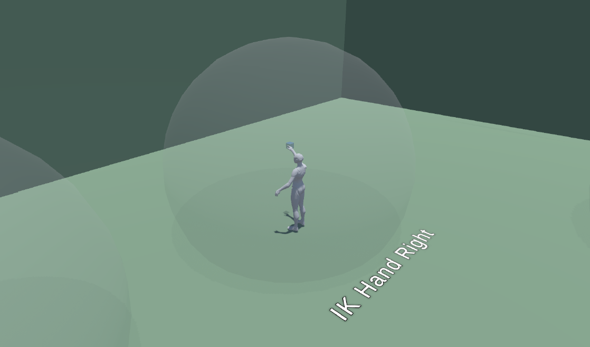
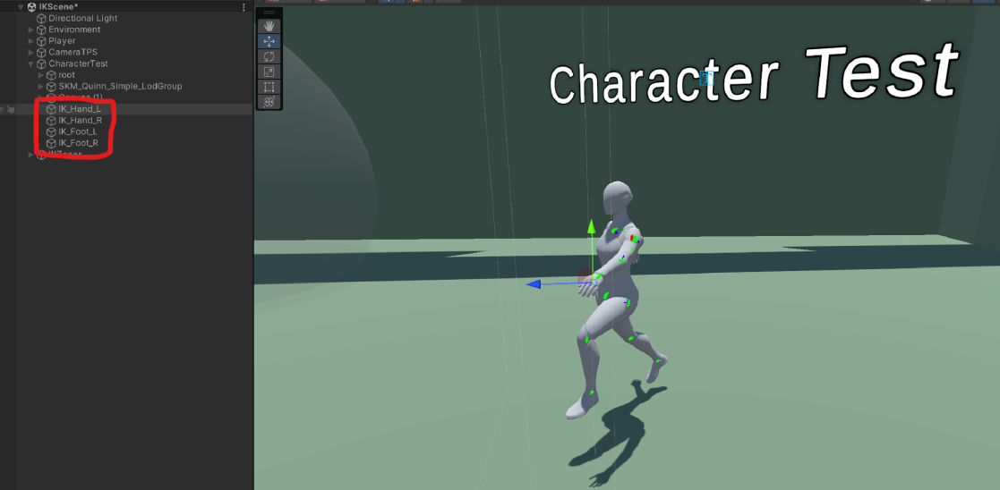
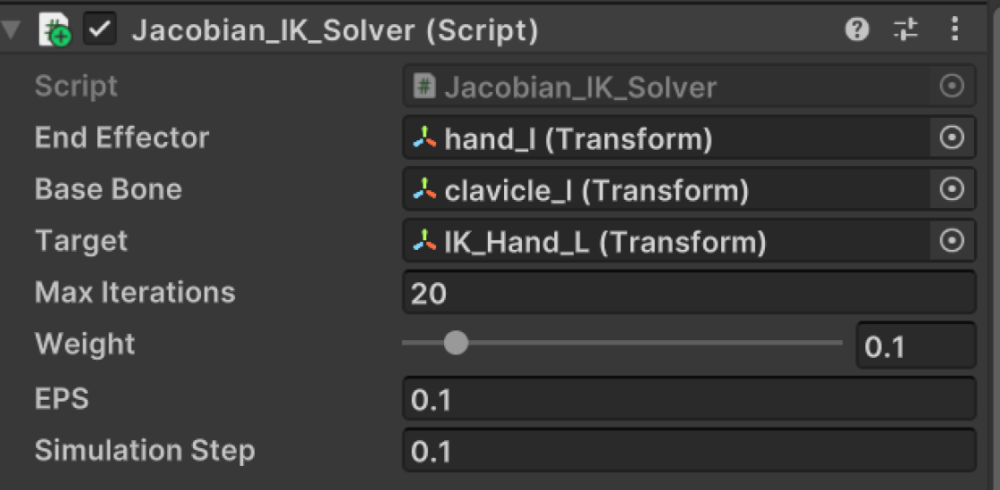
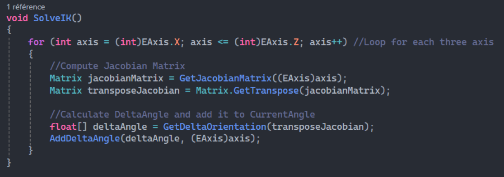
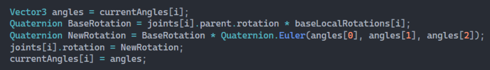
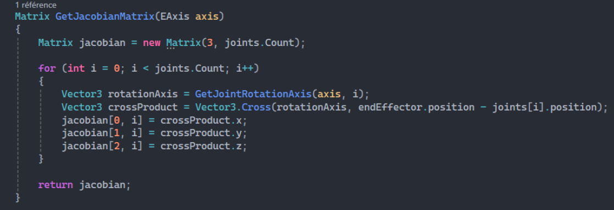
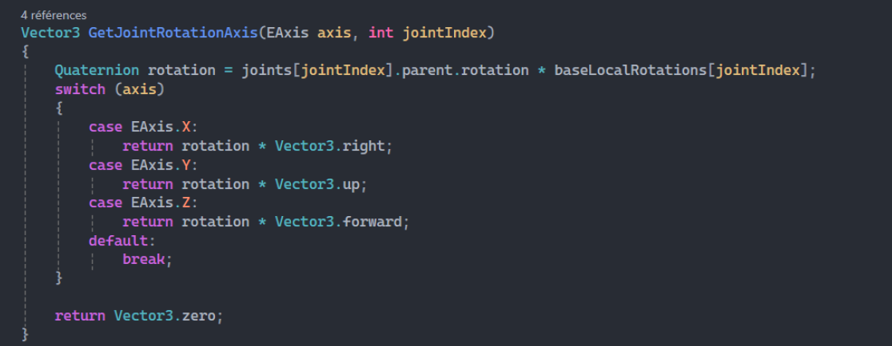
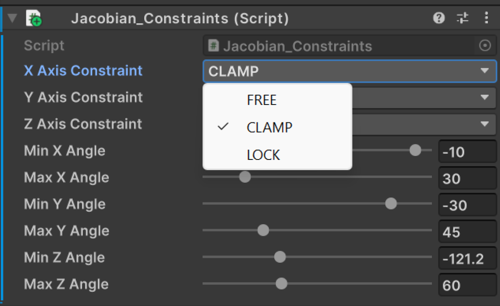
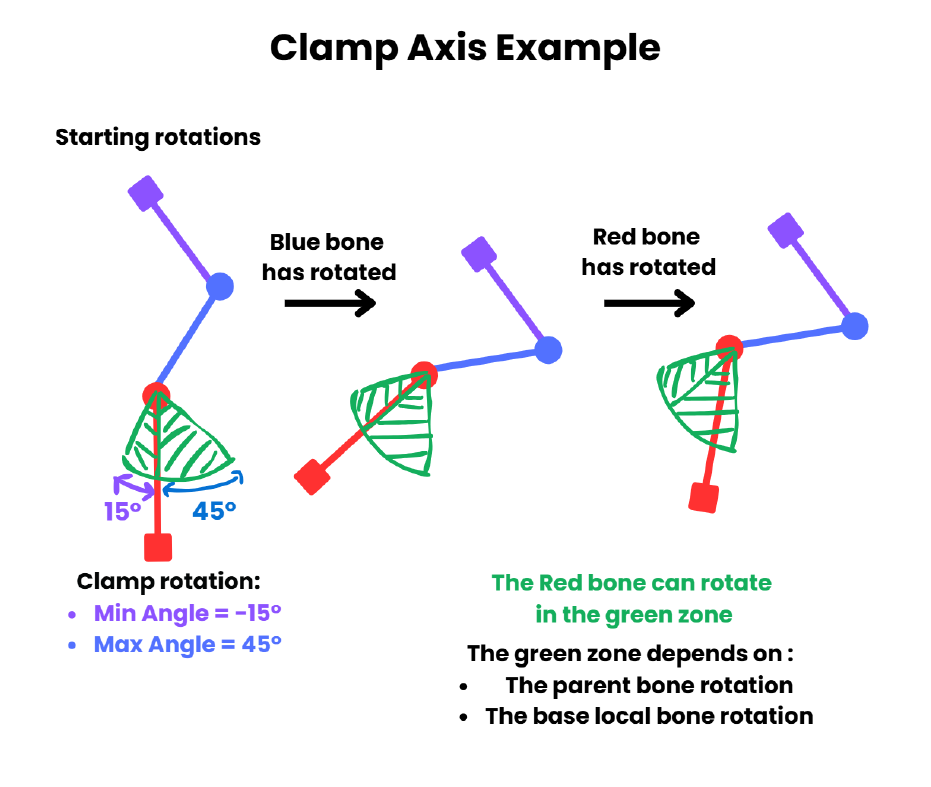

# Inverse Kinematics

## Introduction
Inverse Kinematics is a project made on Unity 3D, focused on implementing its own Inverse Kinematics system based on well-known and functional systems. 
My inverse kinematics system is based on the Jacobian IK system. 
The project began in mid-September 2024 and ended in early December 2024, with other projects running concurrently. 

## Description

### How to use the project:

To use the project, open the Unity Project (Unity 2022.3.34f1) and open the “IKScene” scene. 
You can then launch the game. You can move around with the character to enter different IK zones and try out the Inverse Kinematics system. 
IK Zones trigger Inverse Kinematics on hands or feet. The hands or feet of the character will follow the moving target cube of the IK Zone. 
  
<i>Example of an IK zone for the right hand of the player</i>  

You can also return to the scene window while playing and use the Test Character by moving the IK targets to test the Inverse Kinematics system more deeply. 
The CharacterTest gameobject has 4 child objects used for IK Targets: IK_Hand_L, IK_Hand_R, IK_Foot_L, and IK_Foot_R that you can move around. 
  
<i>Character Test with IK targets</i>  

### Jacobian Method:

I decided to use the Jacobian Method as it is supposed to give more natural results than the CCD method. I created a Jacobian_IK_Solver component that handles IK computations. 
 

The IK system is divided into 4 parts: 
- Computing the Jacobian Matrix
- Transposing the Jacobian Matrix
- Calculating Delta Rotation angles
- Adding delta angles to current angles

Those 4 steps are done 3 times per iteration: once for each axis (X, Y, and Z). 
   

To handle rotations and angles, the BaseLocalRotation of each joint is stored during the Start function. 
A list of Vector3 storing the CurrentAngles of each joint is also created and initialized with angles of 0 degrees. 
The IK system will update the CurrentAngles list during the AddDeltaAngle function. 
When setting the joint rotation, a quaternion is created for the base joint rotation depending on the parent joint rotation and the joint BaseLocalRotation.  
This quaternion is multiplied by a quaternion created with the CurrentAngles of the joint. 
  
<i>Setting joint rotation once the IK system has updated currentAngles</i>  

The Jacobian Matrix is computed with the cross product between the joint rotation axis and the Joint to EndEffector vector.  
The rotation axis is determined by the parent rotation and the BaseLocalRotation of the joint. 
I created a basic Matrix class to handle some Matrix operations. 
  
<i>Computation of the Jacobian Matrix</i>  

 
<i>Computation of the joint rotation axis</i>  

### Constraints:
Setting up constraints was the hardest part of the project. I faced multiple problems such as Gimbal Lock, unexpected rotation behaviors, bones locking themselves, bones jittering everywhere…  
In the end, I got the expected behavior I wanted for my constraint system after multiple research and tests with quaternions and angles.  
I created a Jacobian_Constraints component that can be set on joints. 

 
<i>Constraints Unity Component</i>  

With this component, each axis of the joint can be set as Free, Clamp, or Lock. When setting an axis as locked, it will stay with its base local angle.  
When clamping the axis, you can set the Min Angle and Max Angle for each axis. 
The Min Angle is always negative (or 0), and the Max Angle is always positive, as they act as a
minimum and maximum “offset” rotation.  
This schema explains how the clamping of theconstraint system works. 

 

## Possible Improvements:
This IK system often works well, but there are still some issues with constraints, as sometimes joint rotations don't feel natural, and sometimes weird behaviors still occur. 
Another possible improvement would be to add the Target Rotation of the end effector and joint stretching. 
It would also be a good idea to compare this system with other IK systems, such as CCD or FABRIK. 
